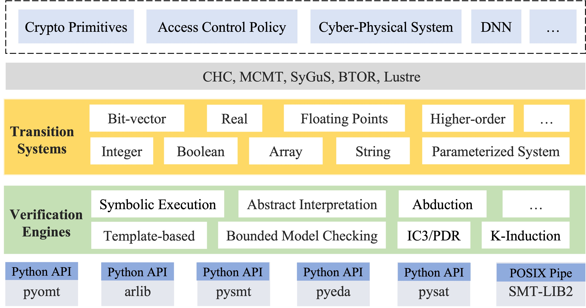

# EFMC

SMT-based Software Model Checking

## 1. Introduction

EFMC is a toolkit for verifying program properties using SMT-based verification engines. It implements multiple approaches, such as template-based verification, property-directed reachability (PDR), Houdini, and k-induction. Each engine offers distinct advantages for different types of programs and properties.

  

### 1.1 Entrance of the Verifier

You can try the following command (in a virtual environemnt)
~~~~
pip install -e .
~~~~

Then, the `efmc` is a command-line tool, which supports programs specified in either CHC (Constrained Horn
Clauses) or SyGuS (Syntax-Guided Synthesis) format with pre- and
post-conditions.

~~~~
efmc -h
~~~~

Besides, the `efsmt` tool support solving the ``exists-forall`` SMT problems.
~~~~
efsmt -h
~~~~

In our transition system encoding, we intentionally abstract away (or "hide") the explicit loop guard. As a result, the constraints for the inductive invariant `Inv` differ slightly from those that directly involve the guard. Specifically, the verification conditions are:

1. Init ⇒ Inv
2. Inv ⇒ Inv'
3. Inv ⇒ Post

The main difference lies in the third condition: here, the "post-condition" refers to the inductive safety property that the invariant should imply, rather than the original post-condition in the program (that do not necessiarly invole the information about the loop guard).

## 2. The Main Verification Engines

Currently, the users can choose various verification engines:

- Template-based (Constraint-based) Approach
- Property-Directed Reachability (PDR)
- K-Induction
- Quantifier Instantiation (NOT Stable)
- Houdini (NOT Stable)
- Abductive Inference (NOT Stable)

For detailed information about each engine, including usage examples and related work, see [OVERVIEW.md](OVERVIEW.md).

## 3. Documentation

We release the doc here:  https://zju-automated-reasoning-group.github.io/efmc/

By deepwiki: https://deepwiki.com/ZJU-Automated-Reasoning-Group/efmc

A tutorial generated by AI:  https://code2tutorial.com/tutorial/214dae64-a7ac-49f6-b9fa-162fffabd51f/index.md

## Publications

~~~~
@inproceedings{ase23efmc,
  title={Demystifying Template-based Invariant Generation for Bit-Vector Programs},
  author={Peisen Yao and Jingyu Ke and Jiahui Sun and Hongfei Fu and Rongxin Wu and Kui Ren},
  booktitle={Proceedings of the 38th IEEE/ACM International Conference on Automated Software Engineering (ASE)},
  year={2023},
  pages={1--13},
  publisher={IEEE}
}
~~~~

## Contributors

Primary contributors to this project:

- rainoftime / cutelimination
- JasonJ2021
- WindOctober
- Zahrinas