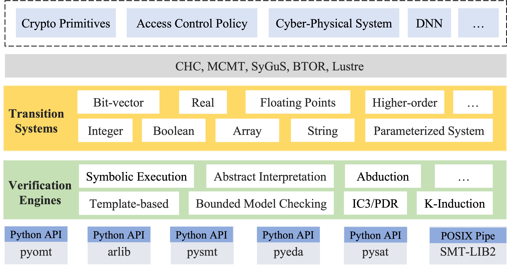

# EFMC

> [!IMPORTANT]
> Active development of efmc has moved to the [`ZJU-PL/aria`](https://github.com/ZJU-PL/aria) repository, under [`aria/efmc`](https://github.com/ZJU-PL/aria/tree/master/aria/efmc). This repository is retained for historical/reference use.

SMT-based Software Model Checking

## 1. Introduction

EFMC is a toolkit for verifying program properties using SMT-based verification engines. It implements multiple approaches, such as template-based verification, property-directed reachability (PDR), Houdini, and k-induction. Each engine offers distinct advantages for different types of programs and properties.

  

### 1.1 Entrance of the Verifier

You can try the following command (in a virtual environemnt)
~~~~
pip install -e .
~~~~

Then, the `efmc` is a command-line tool, which supports programs specified in multiple formats:
- CHC (Constrained Horn Clauses) format (.smt2)
- SyGuS (Syntax-Guided Synthesis) format (.sy, .sl)
- Boogie intermediate verification language (.bpl)
- C programs (.c)

All formats support pre- and post-conditions for verification.

~~~~
efmc -h
~~~~

Besides, the `efsmt` tool support solving the ``exists-forall`` SMT problems.
~~~~
efsmt -h
~~~~

## 2. The Main Verification Engines

[NOTICE!] Our transition system encoding abstracts away (or "hides") the explicit loop guard. As a result, the constraints for the inductive invariant `Inv` differ slightly from those that directly involve the guard. Specifically, the verification conditions are:

1. Init ⇒ Inv
2. Inv ⇒ Inv'
3. Inv ⇒ Post

The main difference lies in the third condition: here, the "post-condition" refers to the (inductive) safety property that the invariant should imply, rather than the original post-condition in the program.

Currently, the users can choose various verification engines:

**Main Engines:**
- Template-based (Constraint-based) Approach
- Property-Directed Reachability (PDR)
- K-Induction
- LLM4Inv (LLM-guided Invariant Synthesis)

**Additional Engines:**
- Quantifier Instantiation (QI)
- Houdini
- Abductive Inference
- Quantifier Elimination (QE)
- Predicate Abstraction
- Symbolic Abstraction
- BDD (Binary Decision Diagrams)
- K-Safety (Relational Verification for Hyperproperties)

For detailed information about each engine, including usage examples and related work, see [OVERVIEW.md](OVERVIEW.md).

## 3. Documentation

We release the doc here:  https://zju-pl.github.io/efmc/

By deepwiki: https://deepwiki.com/zju-pl/efmc

A tutorial generated by AI:  https://code2tutorial.com/tutorial/214dae64-a7ac-49f6-b9fa-162fffabd51f/index.md

## Publications

~~~~
@inproceedings{ase23efmc,
  title={Demystifying Template-based Invariant Generation for Bit-Vector Programs},
  author={Peisen Yao and Jingyu Ke and Jiahui Sun and Hongfei Fu and Rongxin Wu and Kui Ren},
  booktitle={Proceedings of the 38th IEEE/ACM International Conference on Automated Software Engineering (ASE)},
  year={2023},
  pages={1--13},
  publisher={IEEE}
}
~~~~

## Contributors

Primary contributors to this project:

- rainoftime / cutelimination
- JasonJ2021
- WindOctober
- Zahrinas
- Zveneodm
